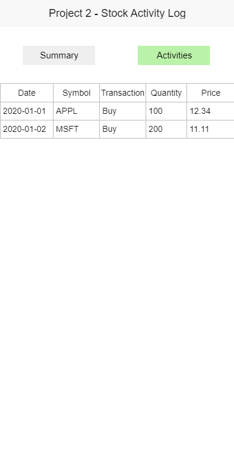

# Readme

## Introduction

- This project is an assignment of College.
- Purpose: Practice TK and database connection
- Usage: The user can add a stock record to SqlLite database, and one can search and list the records

## GUI

### Window 1: Activities Summary

### Window 2: Summaries in Summary

### Window 3: Activities Entry

## Source Code

- **stock_logger.py**:
  - Main application
- **stocklogger_test.py**
  - Unit testing and test cases
- Sqlite database file can be generated when application or test starts

## Documents

- **design.md** (need _mermaid_ [plugins](https://marketplace.visualstudio.com/items?itemName=bierner.markdown-mermaid) and Refer to [Mermaid](https://github.com/mermaid-js))