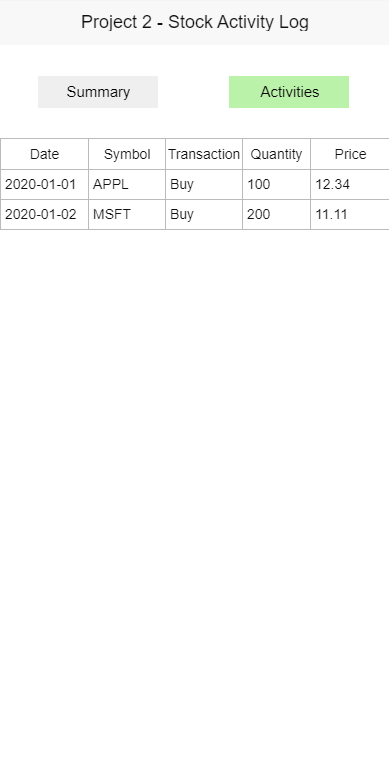

# GUI Design

Based on the napkin design in the instruction document, I created the wireframe.

## Window 1: Summary-Activities

- Major changes during developing
  - Add a scroll bar
  - Add error message display at the bottom

---

## Window 1: Summary-Summary

- Major changes during developing
  - Align the label to the center
  - Change label font size
  - Add error message display at the bottom

---

## Window 2: Activities Entry

- Major changes during developing
  - Add Export Button
  - Align all buttons to the center
  - Add error message display at the bottom
  